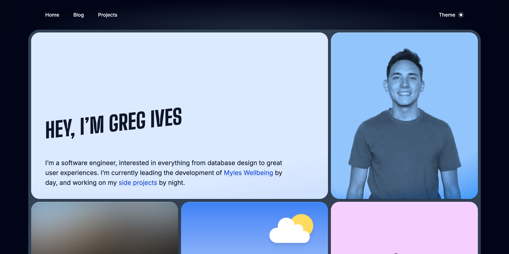

# [gregives.co.uk](https://gregives.co.uk)

Personal website of software engineer Greg Ives, built using the following:

- [Next.js](https://nextjs.org)
- [MDX](http://mdxjs.com)
- [Tailwind CSS](https://tailwindcss.com)
- [Firestore](https://firebase.google.com/docs/firestore)
- Love :heart:

Feel free to take inspiration from my site and explore the source code behind it &mdash; don't copy it though, make it yours!

## Getting Started

Clone the repository:

```bash
git clone https://github.com/gregives/gregives.co.uk
```

Install the dependencies using Yarn:

```bash
yarn
```

Run the development server:

```bash
yarn dev
```

Open [http://localhost:3000](http://localhost:3000) in your browser to see the development server.
