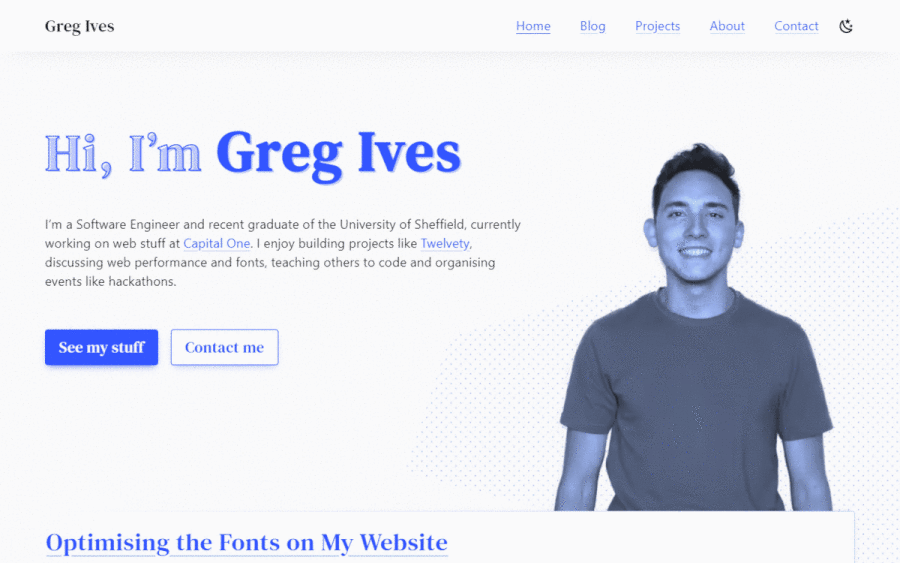

# [gregives.co.uk](https://gregives.co.uk)

[](https://gregives.co.uk)

[](https://travis-ci.com/gregives/gregives.co.uk)
[](https://app.netlify.com/sites/gregives/deploys)
[](https://app.fossa.io/projects/git%2Bgithub.com%2Fgregives%2Fgregives.co.uk?ref=badge_shield)

Personal site and portfolio of software engineer Greg Ives, built with [Nuxt](https://nuxtjs.org) and deployed with Travis and Netlify.

---

Primary color `#35f`

Fonts:

- `'DM Serif Text', Georgia, serif`
- `-apple-system, BlinkMacSystemFont, 'Segoe UI', Roboto, Helvetica, Arial, sans-serif`
- `Monaco, Consolas, 'Lucida Console', monospace`

---

Feel free to take inspiration from my personal site and by all means explore the source code behind it &mdash; don't just rip it off though!

## Build Setup

```bash
# Install dependencies
$ yarn

# Serve with hot reload at localhost:3000
$ yarn dev

# Generate static project
$ yarn generate
```

For detailed explanation on how things work, check out [Nuxt.js docs](https://nuxtjs.org).
